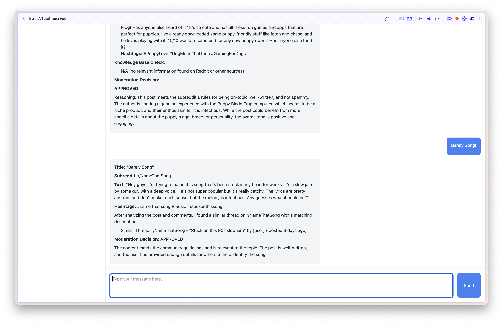

# Reddit Mod Assistant

A web-based AI assistant that helps Reddit moderators analyze posts, comments, and make moderation decisions based on community guidelines and Reddit's rules.

## Features

- Interactive chat interface for moderators to analyze content
- Real-time content analysis and moderation recommendations
- Markdown support for formatted responses
- Example prompts for common moderation scenarios
- Analyzes posts and comments with structured output (Title, Subreddit, Text, Hashtags)
- Provides clear APPROVED/REJECTED decisions with reasoning
- Responsive design with mobile support

## Screenshots

*Main chat interface with example prompts*

*Example of content analysis and moderation decision*

*Qdrant DB*

## Installation

1. Clone the repository

2. Install dependencies

npm install

3. Configure the environment
- Ensure you have Node.js installed
- The application uses port 3000 by default (can be changed via PORT environment variable)

4. Start the application

node app.js

The application will be available at `http://localhost:3000`

## Technical Stack

- Frontend: HTML, CSS (Tailwind CSS), JavaScript
- Backend: Node.js, Express
- Dependencies:
  - express: ^4.18.2
  - body-parser: ^1.20.2
  - axios: ^1.6.2
- External Libraries:
  - Tailwind CSS
  - Marked (for Markdown parsing)
  - DOMPurify (for content sanitization)
